# Context Document: Kafka + Java Microservices Sandbox

**Purpose of this document:** this is a portable context brief for an AI assistant
(any LLM) to pick up this project with full background. It captures not just *what*
was decided, but *why* — so a different assistant continuing this work doesn't
second-guess choices that were already deliberately made through discussion, or
re-litigate trade-offs that were already considered.

If you (the assistant reading this) are being asked to help implement, extend, or
modify this project, treat the decisions below as settled unless the user explicitly
asks to revisit one.

---

## 1. Project intent

This is a **personal/team learning sandbox**, not a production system. The owner's
explicit goals, stated directly:

- Test distributed-systems and microservices **patterns** (SAGA, CQRS, Outbox, etc.)
  in a realistic-enough environment, without depending on real infrastructure or
  being blocked by coordinating with other teams.
- Get **speed, freedom, and independence** to validate architectural ideas before
  proposing changes to real production applications.
- **Learn by building**, incrementally, treating the project like assembling Lego —
  each piece runnable and understood before the next is added.
- Use it as a **team resource**: other developers should be able to plug in their
  own producer/consumer implementations, schemas, and data models without
  fighting the sandbox's structure.

**Explicitly acknowledged trade-off:** this sandbox validates *logical correctness*
of patterns (does the SAGA compensate correctly, does Outbox prevent dual-write),
not production-scale behavior (real network partitions, real traffic volume, full
consumer-group rebalancing storms). It is stage one of a two-stage validation
process — real staging/prod validation still follows before shipping real changes.

---

## 2. Infrastructure architecture

### 2.1 Topology (Docker Compose, modular)

Split into independently-composable overlay files sharing one base, not one giant
compose file:

```
docker-compose.base.yml           # Kafka (KRaft), Schema Registry, Kafka UI, Redis, API Gateway
docker-compose.multibroker.yml    # overlay: upgrades base to 3-broker KRaft cluster
docker-compose.outbox.yml         # Postgres (write), producer service, Debezium/Kafka Connect
docker-compose.cqrs.yml           # MongoDB (read), command-api, query-api (scalable replicas)
docker-compose.saga.yml           # payment-service, inventory-service, saga-orchestrator, their DBs
docker-compose.integrations.yml   # Mailpit (SMTP), SFTP server, notification-service, batch-ingestion-service
docker-compose.observability.yml  # OTel Collector, Seq
docker-compose.override.yml       # gitignored — per-developer local tweaks, auto-merged by Compose
```

Run combinations via `docker compose -f base.yml -f outbox.yml -f cqrs.yml up`, etc.
Rationale: keeps each pattern exercise focused; avoids one sprawling system; lets
devs run only what they're actively testing.

### 2.2 Kafka specifics

- **KRaft mode**, no Zookeeper (Zookeeper is deprecated for new Kafka setups).
- Start with **1 broker** for early milestones (fast iteration), graduate to a
  **3-broker cluster** (replication factor 3, min ISR 2) once testing
  failover/rebalancing/replication behavior specifically — this is an opt-in
  overlay, not the permanent default, for resource/speed reasons.
- **Dual listener setup is mandatory**: an `EXTERNAL` listener for host-machine
  access (`localhost:9092`) and an internal listener (`PLAINTEXT`, e.g.
  `kafka:9094`) for container-to-container traffic via Docker DNS. This trips
  people up constantly — don't collapse it to one listener.
- **Avro** for serialization (explicit prerequisite from the user, to be closer to
  a real prod environment), with **Confluent Schema Registry** as its own
  container. Compatibility mode: `BACKWARD` by default. Subject naming strategy:
  default `TopicNameStrategy`, switch to `RecordNameStrategy` if multiple event
  types end up sharing one topic.
- **Kafka UI** (provectuslabs/kafka-ui) for visual topic/consumer-group/DLQ
  inspection — treated as a first-class debugging tool, not an afterthought.
- Topics partitioned deliberately (e.g. 6 partitions) once multi-broker is active,
  to exercise partition-assignment strategies and consumer-group rebalancing.

### 2.3 Sharding clarification

"Sharding" in Kafka *is* partitioning — there is no separate sharding layer.
A topic with N partitions is already sharded N ways. (If DB-level sharding across
Postgres/Mongo instances is ever wanted, that's a distinct, separate concern not
yet designed.)

---

## 3. Architectural patterns covered (infrastructure-level / microservices patterns)

Each of these has a dedicated Docker Compose overlay and Spring Boot service(s):

- **Transactional Outbox** — producer service writes business entity + outbox
  event in the same DB transaction; **Debezium** (via Kafka Connect, using the
  Outbox Event Router SMT) tails the Postgres WAL and publishes to Kafka. Chosen
  over a naive polling publisher deliberately, since it's the real prod-grade
  approach (CDC, not polling).
- **CQRS** — write side: `command-api` + Postgres (relational, since write-side
  integrity matters and this is also where the outbox table lives). Read side:
  `query-api` + **MongoDB** (denormalized documents — deliberately a different DB
  technology, not just a second Postgres, to demonstrate genuine polyglot
  persistence and because Mongo's document shape fits denormalized read models
  naturally). `query-api` runs multiple replicas to also exercise load balancing.
- **SAGA** — both **choreography** (services react to each other's events
  directly) and **orchestration** (a dedicated `saga-orchestrator` service drives
  the flow explicitly) are to be implemented and compared, not just one. Domain:
  order → payment → inventory reservation → shipped, reused as the same business
  process across Outbox/CQRS/SAGA so the three pattern exercises aren't
  disconnected toy examples.
- **Caching (Redis)** — cache-aside as the primary strategy, contrasted with
  write-through; plus an **event-driven cache invalidation** approach (a consumer
  listens for domain events and actively evicts/refreshes cache keys, rather than
  relying on TTL alone) — this ties Redis into the event-driven backbone instead
  of being a bolted-on side concern.
- **DLQ (Dead Letter Queue)** — not a separate container, just topic + consumer
  error-handling config (Spring Kafka `DefaultErrorHandler` +
  `DeadLetterPublishingRecoverer`). Explicit distinction enforced between
  retryable errors (transient DB timeout → retry with backoff) and non-retryable
  errors (bad Avro payload → straight to DLQ, no infinite retry). A manual DLQ
  reprocessor endpoint is included, since real teams rarely fully automate DLQ
  replay.
- **API Gateway + Load Balancer** — **Spring Cloud Gateway** chosen over a
  dedicated infra product (Kong/Traefik/Nginx) specifically because the stack is
  otherwise all Spring Boot and the goal is to *build and test* gateway logic as
  code, not evaluate an infra product. Spring Cloud Gateway also owns load
  balancing (via Spring Cloud LoadBalancer) rather than stacking a separate LB in
  front of it. Resilience4j circuit breakers live at the Gateway route level.
- **Webhooks** — both directions modeled: outbound (a `notification-service`
  consumes domain events and POSTs to external URLs, using Resilience4j for
  retry/circuit-breaking) and inbound (external system calls into the Gateway,
  which publishes to Kafka — models e.g. a payment provider's webhook). A mock
  webhook receiver (simple echo endpoint) stands in for the external system, kept
  self-contained rather than depending on a real third party.
- **SMTP** — **Mailpit** (fake SMTP server + web UI) — never a real mail provider.
  Owned by the same `notification-service` as webhooks (both are "reactions to
  domain events").
- **FTP/SFTP batch ingestion** — an SFTP container (`atmoz/sftp`) + a
  `batch-ingestion-service` (Spring Batch / Spring Integration FTP inbound
  adapter) that polls for files, parses rows, and publishes **one Kafka event per
  row** — explicitly designed to flow through the *same* use case/port that a
  REST-triggered order does, to prove the domain layer doesn't care whether a
  command originated from HTTP or a batch file (**batch-to-stream bridging**).

---

## 4. Code architecture and design principles

### 4.1 Structural pattern: Hexagonal Architecture (Ports & Adapters), per service

Chosen deliberately over Vertical Slice Architecture (VSA) — VSA fits simple
CRUD-shaped apps well, but this project's domain logic (SAGA compensations,
Outbox transaction boundaries, CQRS split models) is exactly the complex,
shared-domain-concept case where VSA would cause duplication instead of helping.

Reference package layout per service:

```
order-service/
├── domain/                # no Spring, no Kafka, no JPA — pure Java
│   ├── Order.java                  # rich aggregate root
│   ├── OrderCreatedEvent.java      # domain event (distinct from the Avro wire event)
│   └── OrderRepository.java        # PORT (interface only)
├── application/
│   └── CreateOrderUseCase.java     # orchestrates domain + ports; one use case = one class
├── adapters/
│   ├── in/
│   │   ├── rest/OrderController.java
│   │   └── batch/OrderFileListener.java   # FTP-sourced orders call the SAME use case
│   └── out/
│       ├── persistence/JpaOrderRepository.java   # implements the port
│       ├── kafka/KafkaOrderEventPublisher.java
│       └── outbox/OutboxEventWriter.java
```

**SOLID** is treated as the continuous discipline underlying Hexagonal, not a
separate/competing choice — Dependency Inversion specifically is the mechanism
that makes the port/adapter boundary work at all.

### 4.2 DDD — light tactical patterns only, not full strategic DDD

Full DDD ceremony (context-mapping workshops, ubiquitous-language exercises) was
explicitly rejected as overkill for a personal/team lab. Adopted lightly:

- **Each microservice = one bounded context** (`order-service`, `payment-service`,
  `inventory-service` each own their model fully; no shared database, no shared
  domain model between services).
- **Aggregate root** as the transaction/consistency boundary — this is what makes
  the Outbox pattern's "same transaction" guarantee correct in the first place.
- **Domain events** as first-class objects distinct from the Avro-serialized wire
  event — mapping between them happens at the adapter boundary, keeping
  Avro-generated classes out of `domain/`.

Explicitly skipped: Specification pattern, heavy domain-service-vs-application-
service distinctions — useful at large enterprise scale, mostly ceremony here.

### 4.3 Rich vs. anemic domain models — split deliberately by layer, not applied uniformly

- **Rich** where state transitions and invariants matter: aggregate roots
  (`Order`, `Payment`, `Inventory`). Behavior lives on the entity itself
  (`order.confirm()`, `payment.markFailed()`), making illegal states
  unrepresentable rather than hoping callers check state first. This directly
  supports SAGA state-transition logic and Outbox correctness (state change and
  event emission happen together, atomically, inside the aggregate method).
- **Anemic** where the object's only job is to carry data across a boundary:
  CQRS read models (`query-api`'s projections — no behavior, no invariants,
  rebuilt from events, mutation never happens directly), DTOs at adapter
  boundaries, and Avro-generated wire classes (always anemic — never put domain
  behavior on generated code).
- **JPA entity vs. domain object**: for the reference service (`order-service`),
  keep them **separate classes** (`Order` domain object with no annotations, plus
  a separate `OrderJpaEntity` in the adapter layer with a mapper between them) —
  chosen deliberately for the reference implementation to actually teach the
  discipline properly, even though it's more boilerplate. Simpler services may
  pragmatically annotate the domain class directly once the discipline is
  understood.

### 4.4 GoF and microservices design patterns — applied only where they solve a concrete problem

Explicit instruction from the user: patterns should be used only where genuinely
applicable, not applied everywhere for coverage. Full mapping (pattern →
milestone → justification) lives in the separate `implementation-roadmap.md`
document; summary:

| Pattern | Where | Why |
|---|---|---|
| Adapter | Ports/adapters boundary; batch vs REST inbound adapters | Core structural pattern of the whole project |
| Factory Method | `Order.create()` | Enforces valid aggregate creation |
| Repository | Persistence ports | Swappable adapters (in-memory → JPA → Testcontainers) |
| Observer (conceptual) | Domain events on aggregate state change | Decouples state change from side effects |
| Strategy | Cache strategies (cache-aside vs write-through) | User explicitly wants to compare strategies |
| Dead Letter Channel | DLQ handling | Formal name for the DLQ pattern |
| Circuit Breaker | Resilience4j, Gateway + webhook calls | Downstream failure isolation |
| Facade (conceptual) | API Gateway | What the Gateway structurally is to a client |
| State | Payment/Inventory aggregate state machines | Illegal transitions structurally impossible |
| Command | Saga-orchestrator issuing explicit commands | Makes orchestration intent explicit/testable |
| Mediator (conceptual) | Saga-orchestrator | Services coordinate through it, not each other |
| Template Method | Batch file parsing (conditional) | Only if a second file format is ever added — not preemptive |

Explicitly **excluded**: Singleton (Spring container handles lifecycle), forced
Builder everywhere, Decorator wrapped around Resilience4j (it already implements
that pattern internally — redundant to re-wrap).

### 4.5 API documentation

Every service exposing a REST API uses **springdoc-openapi**, generating an
OpenAPI 3 spec from controllers/DTOs/Bean Validation annotations at
runtime — chosen over the older SpringFox (effectively dead since 2020,
incompatible with Spring Boot 3.x). Both **Swagger UI** and **Scalar UI**
are exposed over the same generated spec, giving a choice of renderer
without maintaining two separate doc pipelines.

Doc availability is **environment-gated**, not always-on: enabled for
local/dev, disabled by default for anything resembling production
(`springdoc.api-docs.enabled=false`, which also takes the UI down since it
depends on that same spec endpoint) — an unauthenticated, fully-documented
map of every endpoint and payload shape is not something to expose by
default. This follows the same env-var-for-values convention established
in `CONFIGURATION.md`. First established in M2, applies to every
REST-exposing service thereafter (`command-api`, `query-api`,
`api-gateway`).

### 4.6 Object mapping

**MapStruct** is the intended library for DTO/entity/read-model mapping,
once a real mapping need exists — not introduced preemptively. M2's single
`Order` ↔ `OrderCreated` Avro event conversion is simple enough to write by
hand; MapStruct earns its place starting M3 (JPA entity ↔ domain `Order`)
or M4 (Mongo document ↔ read DTO), where multiple shapes and directions
make hand-written mapping genuinely tedious and error-prone. See
`docs/REFERENCES.md` for the rationale behind choosing it over
ModelMapper/reflection-based alternatives.

### 4.7 Idempotent consumers

Kafka's delivery guarantee is **at-least-once**, not exactly-once, for
ordinary consumers — every consumer in this system must be written
assuming a message can be redelivered (broker failover, consumer
rebalance mid-processing, DLQ manual replay, retry-with-backoff all
reintroduce a message that may have already been fully processed).
Idempotency is therefore a standing requirement, not an optional
hardening step:

- Consumers that cause a state change (payment processing, inventory
  reservation, outbox-derived side effects) must be safe to process the
  same message twice with no different outcome — typically via a
  dedup/idempotency key (e.g. the event's own ID) checked before applying
  the effect.
- This applies especially at M5 (DLQ replay), M7 (SAGA — both
  choreography and orchestration), and M8 (webhook retries) — anywhere
  retry or replay is a designed part of the system, not just a rare edge
  case.

---

## 5. Build tooling and dependencies

- **Maven**, multi-module. Chosen over Gradle because Confluent's Avro tooling,
  Debezium reference projects, and ArchUnit examples default to Maven-first
  documentation — less friction translating examples for this specific stack.
- Multi-module layout:
  ```
  kafka-microservices-lab/
  ├── pom.xml                     # parent — shared dependencyManagement
  ├── sandbox-arch-rules/         # shared ArchUnit rule module, depended on by every service's tests
  ├── sandbox-avro-schemas/       # .avsc files + avro-maven-plugin, produces shared generated-POJO JAR
  ├── order-service/
  ├── payment-service/
  ├── inventory-service/
  ├── command-api/
  ├── query-api/
  ├── notification-service/
  ├── batch-ingestion-service/
  └── api-gateway/
  ```
- **Core Spring Boot starters** (every service): `web`, `actuator`, `validation`.
  `lombok` allowed in adapter-layer DTOs/entities, deliberately **avoided in
  `domain/`** — rich aggregates should expose explicit, visible behavior methods,
  not `@Data`-generated setters that reopen the anemic-domain hole.
- **Kafka/Avro**: `spring-kafka`, `kafka-avro-serializer`,
  `kafka-schema-registry-client`, `avro-maven-plugin`.
- **Persistence**: `spring-boot-starter-data-jpa` + `postgresql` driver
  (write-side services), `spring-boot-starter-data-mongodb` (`query-api`),
  `spring-boot-starter-data-redis` (Lettuce client), **`flyway-core`** for schema
  migrations (deliberately not `hibernate.ddl-auto=update` — migrations should be
  explicit and auditable, consistent with the project's overall "be deliberate"
  ethos).
- **Resilience**: `resilience4j-spring-boot3` — used across Gateway circuit
  breaking, webhook retry/backoff, and DLQ retryable-vs-non-retryable logic.
- **Gateway**: `spring-cloud-starter-gateway` (reactive/WebFlux — note this is
  the one module that's reactive while the rest are servlet-based; a deliberate,
  known trade-off, not an oversight), `spring-cloud-starter-loadbalancer`.
- **Batch/FTP**: `spring-boot-starter-batch`, `spring-integration-ftp`/`-sftp`.
- **Email**: `spring-boot-starter-mail`, pointed at Mailpit locally.
- **Debezium**: runs as its own Kafka Connect container — no Maven dependency in
  `order-service` itself; connector config deployed via the Connect REST API.
- **Testing**: `spring-boot-starter-test` (JUnit 5, AssertJ, Mockito),
  `testcontainers` (junit-jupiter, postgresql, mongodb, kafka modules — Schema
  Registry and SFTP/Mailpit have no first-party module, use `GenericContainer`),
  `awaitility` (for eventual-consistency assertions — CQRS lag, cache
  invalidation — instead of flaky `Thread.sleep`), `archunit-junit5`.
- **Code quality**: Spotless (auto-formatting), Checkstyle or PMD, JaCoCo
  (coverage as a *signal*, not a hard percentage gate — chasing a global number
  produces low-value tests).
- **Observability**: `opentelemetry-spring-boot-starter` (auto-instruments Spring
  MVC/WebFlux, JDBC, and Kafka clients — Kafka producer/consumer spans are
  automatic, important for tracing event flows), `logstash-logback-encoder` for
  structured JSON logs routed through the same OTLP pipe.

---

## 6. Observability stack

- **OpenTelemetry** end-to-end: every service exports via OTLP
  (`OTEL_EXPORTER_OTLP_ENDPOINT` env var) to a central **OTel Collector**
  container, which exports to **Seq**.
- **Seq** (datalust/seq) chosen as the single backend for **all three signals**
  — logs, traces, AND metrics. This was explicitly verified as current
  information (Seq added native OTLP metrics ingestion and trace
  visualization in the 2026.1 release — prior to that, Seq was logs-only, so
  this is a meaningfully recent capability, not something to assume from older
  general knowledge). One backend instead of Seq + Prometheus + Grafana +
  Jaeger separately — simpler for a lab, and gives correlated logs/traces/metrics
  in one UI.
- **Important implementation detail**: Seq implements OTLP via gRPC and
  HTTP/protobuf — **HTTP/JSON is not supported** — the Collector/SDK config must
  use one of the supported encodings or export will silently fail.
- An OTel Collector sits in front of Seq (not services pointing directly at Seq)
  so batching, sampling, and attribute enrichment (e.g. tagging spans with which
  compose module/pattern they came from) can be centralized, and so the backend
  could be swapped/duplicated later without touching application code.
- Deliberately wired up **late** in the build order (after SAGA is working), so
  there's a real multi-service failure scenario worth tracing when observability
  comes online, rather than an empty pipe.

---

## 7. Testing strategy (four tiers)

1. **Unit tests** — no Spring context, no containers. Targets: domain logic
   (`Order` state transitions), SAGA compensation decision logic, cache-key/TTL
   logic, Avro↔domain mappers, retry/backoff classification logic.
2. **Architecture tests (ArchUnit)** — fast, no Spring context, no Docker.
   Enforces structure as executable rules rather than relying on code review or
   documentation. Packaged as a **shared module** (`sandbox-arch-rules`) that
   every service's test suite depends on, so the rules stay consistent across
   services and a teammate plugging in their own producer/consumer gets the
   rules "for free." Core rules: domain must not depend on adapters/Spring/JPA;
   application must not depend on adapters directly; adapters implement ports
   (dependency-inversion direction proof); bounded-context isolation between
   services; only domain/application may write to the outbox repository (a
   real correctness property, not just style). Deliberately **not**
   over-specified early — only rules that map to an actual correctness property,
   added as real violations are noticed rather than preemptively.
3. **Integration tests (Testcontainers)** — real Postgres/Mongo/Redis/Kafka via
   ephemeral, test-scoped Docker containers (not the running sandbox itself).
   `@DynamicPropertySource` injects container-assigned ports into Spring config.
   Pattern used: a **singleton container base class** per module (containers
   started once for the whole test run, not per test class) to keep the suite
   fast — module-specific base classes (e.g. `AbstractOutboxIntegrationTest`
   starts only Postgres+Kafka, not every container in the system) so the fastest
   tests aren't waiting on containers they don't need.
4. **E2E/smoke** — full flow through multiple real services, used sparingly
   (e.g. one true end-to-end test through the actual Debezium container, not
   as a routine per-class pattern since it's heavier/slower).

---

## 8. Configuration/flexibility design (for team reuse)

Explicit goal: other developers should be able to plug in their own
producer/consumer apps, DB models, and Avro schemas without fighting the
sandbox's structure. Two distinct mechanisms, not conflated:

- **Environment variables** — for *values*, not structure: bootstrap servers,
  ports, topic names, consumer group IDs, DB connection strings/credentials,
  Schema Registry URL/compatibility mode, replica counts, cache TTLs,
  retry/backoff intervals, and **which Docker image/build-context to use**
  (`PRODUCER_IMAGE=./producer-api` or a prebuilt image — this is the actual
  "bring your own producer" mechanism, letting a dev's own build context
  replace the reference implementation while the rest of the sandbox is
  unchanged).
- **Volume mounts / build-context swaps** — for *structure*: a dev's own
  `.avsc` schema directory mounted in via `AVRO_SCHEMA_PATH`, a dev's own service
  code via `build:` pointing at their own directory. Deliberately **not**
  attempted via env vars — trying to configure DB table shape or schema
  structure through environment variables would mean building a config language
  instead of a lab, and was explicitly rejected as the wrong mechanism.
- **Spring profiles** as the code-side counterpart — select *behavior*
  (`SPRING_PROFILES_ACTIVE=outbox|cqrs|saga`) rather than infra wiring.
- `.env.example` checked into the repo; `docker-compose.override.yml`
  (gitignored, auto-merged by Compose) for individual local tweaks without
  touching shared files.
- A `CONFIGURATION.md` should document this two-mechanism split explicitly so
  the next developer knows which lever to pull for which kind of change.

---

## 9. Deliberately parked for a later phase (not oversights)

- **Authentication/Authorization** (JWT, RBAC, OAuth2/OIDC — Keycloak is the
  natural fit if pursued) — cross-cutting, orthogonal to every pattern built so
  far; deferred until there's a real Gateway and real services to attach it to,
  rather than designing it against a guess.
- **Frontend** — a pure consumer of the Gateway's REST API; has zero influence
  on any backend architectural decision, so its absence doesn't block anything.

---

## 10. Architecture diagram (Mermaid)

The following diagram represents the full target architecture (all modules
overlaid together — in practice, only relevant compose files run at once per
testing session):

```mermaid
flowchart TB

    DEV["Developer / Client<br/>(curl, Postman, IDE)"]

    subgraph GATEWAY_LAYER["Entry Layer"]
        GW["API Gateway<br/>Spring Cloud Gateway<br/>+ Load Balancer + Circuit Breaker"]
    end

    subgraph KAFKA_CLUSTER["Kafka Cluster (KRaft, 3 Brokers)"]
        K1["Broker 1"]
        K2["Broker 2"]
        K3["Broker 3"]
        SR["Schema Registry<br/>(Avro)"]
        UI["Kafka UI"]
    end

    subgraph OUTBOX_MODULE["Outbox Module"]
        ORD["order-service<br/>(producer-api)"]
        PGW[("Postgres<br/>orders_write<br/>+ outbox table")]
        DBZ["Debezium<br/>(Kafka Connect)<br/>Outbox Event Router"]
    end

    subgraph CQRS_MODULE["CQRS Module"]
        CMD["command-api"]
        QRY1["query-api #1"]
        QRY2["query-api #2"]
        QRY3["query-api #3"]
        MDB[("MongoDB<br/>orders_read<br/>(denormalized)")]
        REDIS[("Redis<br/>cache-aside +<br/>event-driven invalidation")]
    end

    subgraph SAGA_MODULE["SAGA Module (choreography / orchestration)"]
        PAY["payment-service"]
        INV["inventory-service"]
        ORCH["saga-orchestrator<br/>(optional mode)"]
        PGP[("Postgres<br/>payments")]
        PGI[("Postgres<br/>inventory")]
    end

    DLQ["DLQ Topics<br/>(order-events.DLT)<br/>+ manual reprocessor endpoint"]

    subgraph INTEGRATIONS_MODULE["Integrations Module"]
        NOTIF["notification-service<br/>(webhooks + email)"]
        MAILPIT["Mailpit<br/>(fake SMTP + web UI)"]
        EXT_HOOK["Mock external webhook<br/>receiver (echo endpoint)"]
        SFTP[("SFTP server<br/>(file drop)")]
        BATCH["batch-ingestion-service<br/>(Spring Batch)"]
    end

    subgraph OBSERVABILITY_MODULE["Observability Module"]
        OTEL["OTel Collector<br/>(OTLP gRPC/HTTP receiver)"]
        SEQ["Seq<br/>logs + traces + metrics"]
    end

    %% Entry flow
    DEV --> GW
    GW --> ORD
    GW --> CMD
    GW --> QRY1
    GW --> QRY2
    GW --> QRY3

    %% Outbox flow
    ORD -- "1. write Order +<br/>OutboxEvent (same TX)" --> PGW
    PGW -- "2. WAL read (CDC)" --> DBZ
    DBZ -- "3. publish event" --> K1

    %% Kafka internal
    K1 <-. replicate .-> K2
    K2 <-. replicate .-> K3
    K3 <-. replicate .-> K1
    K1 --- SR
    K1 --- UI

    %% CQRS consumption
    K1 -- "order-events" --> CMD
    K1 -- "order-events" --> QRY1
    K1 -- "order-events" --> QRY2
    K1 -- "order-events" --> QRY3
    CMD --> PGW
    QRY1 --> MDB
    QRY2 --> MDB
    QRY3 --> MDB
    QRY1 <--> REDIS
    QRY2 <--> REDIS
    QRY3 <--> REDIS
    K1 -. "cache invalidation event" .-> REDIS

    %% SAGA flow
    K1 -- "OrderCreated" --> PAY
    PAY -- "PaymentCompleted /<br/>PaymentFailed" --> K1
    K1 -- "PaymentCompleted" --> INV
    INV -- "InventoryReserved /<br/>InventoryFailed" --> K1
    K1 -.orchestration mode.-> ORCH
    ORCH -.-> PAY
    ORCH -.-> INV
    PAY --> PGP
    INV --> PGI

    %% DLQ flow
    QRY1 -. "failed msg,<br/>exhausted retries" .-> DLQ
    PAY -. "failed msg" .-> DLQ
    INV -. "failed msg" .-> DLQ
    NOTIF -. "failed email/webhook" .-> DLQ
    DLQ -. "manual replay" .-> K1

    %% Integrations flow - outbound (event-driven fan-out)
    K1 -- "OrderCreated /<br/>PaymentFailed" --> NOTIF
    NOTIF -- "send email" --> MAILPIT
    NOTIF -- "POST webhook" --> EXT_HOOK

    %% Integrations flow - inbound (batch-to-stream bridge)
    SFTP -- "1. file arrives" --> BATCH
    BATCH -- "2. parse rows" --> BATCH
    BATCH -- "3. publish 1 event/row" --> K1

    %% Inbound webhook variant (external system -> gateway -> Kafka)
    EXT_HOOK -. "inbound webhook<br/>(e.g. payment provider)" .-> GW

    %% Observability flow - OTLP telemetry (traces, metrics, logs)
    GW -. otlp .-> OTEL
    ORD -. otlp .-> OTEL
    CMD -. otlp .-> OTEL
    QRY1 -. otlp .-> OTEL
    PAY -. otlp .-> OTEL
    INV -. otlp .-> OTEL
    NOTIF -. otlp .-> OTEL
    BATCH -. otlp .-> OTEL
    OTEL -- "export" --> SEQ

    classDef broker fill:#2b6cb0,color:#fff,stroke:#1a4971
    classDef store fill:#2f855a,color:#fff,stroke:#1c4a32
    classDef service fill:#805ad5,color:#fff,stroke:#553396
    classDef gateway fill:#c05621,color:#fff,stroke:#7b3712
    classDef dlq fill:#9b2c2c,color:#fff,stroke:#631818
    classDef integration fill:#b7791f,color:#fff,stroke:#744210
    classDef observability fill:#4a5568,color:#fff,stroke:#2d3748

    class K1,K2,K3 broker
    class PGW,MDB,REDIS,PGP,PGI,SFTP store
    class ORD,CMD,QRY1,QRY2,QRY3,PAY,INV,ORCH,DBZ,NOTIF,BATCH service
    class GW gateway
    class DLQ dlq
    class MAILPIT,EXT_HOOK integration
    class OTEL,SEQ observability
```



*(Known limitation, noted during design: this single diagram is dense by design
— it overlays every module at once. If used for team onboarding rather than as
an AI context artifact, splitting into a high-level module map plus per-module
detail diagrams was recommended but not yet done.)*

---

## 11. Implementation roadmap

A separate, detailed milestone-by-milestone build plan (`implementation-roadmap.md`,
M0 through M10) already exists alongside this document, sequencing the build as:
foundations → single-broker Kafka → first Hexagonal service → Outbox → CQRS →
DLQ/resilience → multi-broker + Gateway/LB → SAGA (choreography then
orchestration) → boundary integrations (webhooks/SMTP/FTP) → observability →
architecture-test hardening. Each milestone has an explicit "definition of done"
gate, generally phrased as "deliberately break this and confirm it recovers
correctly," not just a happy-path check. If that document is available, defer to
its exact sequencing and gates; this section is a summary pointer, not a
replacement for it.

---

## 12. How to use this document

If you are an LLM being given this document as context: treat Sections 2–9 as
**settled architectural decisions with rationale**, not open questions to
re-derive. It's reasonable to point out a genuine flaw or a newly-relevant
consideration the user hasn't accounted for — but don't reopen decisions (e.g.
"have you considered Zookeeper instead of KRaft," "why not VSA instead of
Hexagonal") that were already explicitly discussed and reasoned through above,
unless the user asks you to revisit them.
